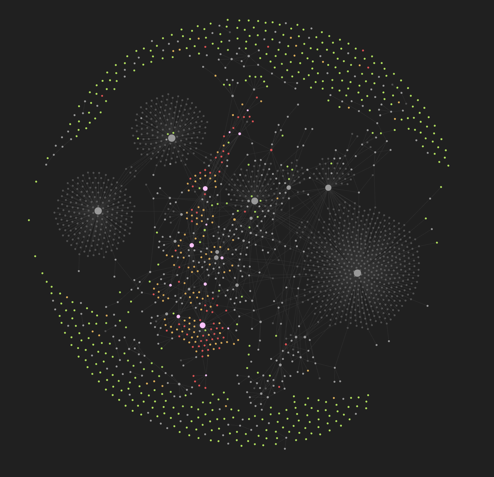

# Technology Graph

## An experiment to identify relationships between technologies.

#### Objective
- Index all publically disclosed technologies.
- Indicate relationships between them, such as dependencies or enablers.
- Create a comprehensive knowledge graph of the [technium](https://kk.org/thetechnium/the-seventh-kin/).
- Provide a standardized framework around which anyone can analyze the *technologial ecosystem*.
- Help non-experts undertand the *nature* of technology and its fundamental interconnectedness.
- Publish findings on [GitHub](https://github.com/mz-000/TG).

---

#### Start here: [[Control of Fire]] 🔥

---

#### Collaboration
- You should load this repository locally in [Obsidian](https://obsidian.md).
- Either [download the Vault](https://github.com/mz-000/TG/archive/refs/heads/main.zip) the Vault as a [[ZIP File]] or install a GitHub client on your [[Computer]].
- Feel free pushing new technologies and links.
- Please add indicate dependencies/backlinks and sources for any new technologies.

---

#### About
- An Envisioning initiative by Michell Zappa.
- Find out more on https://envisioning.io/welcome -> #tg

---

#### Tags
- #Domain 
- #Technology 
- #Application 
- #Method 

---

